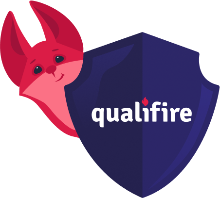

# Agent Security with Qualifire

This tutorial demonstrates how to integrate Qualifire into your AI agent workflows to implement robust guardrails and take preemptive action against common LLM vulnerabilities such as prompt injections, unsafe content, hallucinations, and policy breaches. You will learn how to use both the Gateway and the SDK to protect your agents.

## Quick Start

1.  **Sign up for Qualifire:** If you haven't already, sign up at [https://app.qualifire.ai](https://app.qualifire.ai) and obtain your API key.
2.  **Set up your environment:** Ensure you have Python installed. You will also need to install the necessary packages listed in `requirements.txt` (which will be created as part of the notebook).
3.  **Open the notebook:** Launch Jupyter Notebook and open `1-agent-security-with-qualifire.ipynb`.
4.  **Run the cells:** Follow the instructions in the notebook, execute the code cells sequentially.

## Tutorial Structure

The tutorial is provided as a Jupyter notebook (`1-agent-security-with-qualifire.ipynb`) and includes:

- Setting up a basic Streamlit chatbot application with OpenAI GPT-4.1.
- Integrating using the ** Gateway** to protect LLM calls.
- Integrating using the ** SDK** for fine-grained control over evaluations.
- Demonstrating how to detect and handle:
  - Prompt Injections
  - Unsafe Content
  - Hallucinations
  - Policy Breaches
- Instructions on how to configure policies and view results in the platform.

## Tutorial Files

📓 **[Tutorial 1: Agent Security with Qualifire](./1-agent-security-with-qualifire.ipynb)**  
Core tutorial covering Qualifire integration fundamentals, Gateway usage, and SDK implementation for agent security.

📓 **[Tutorial 2: Agent Security with Qualifire UI](./2-agent-security-with-qualifire-ui.ipynb)**  
Extended tutorial focusing on user interface aspects and advanced security implementations.
